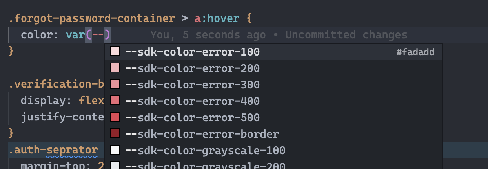
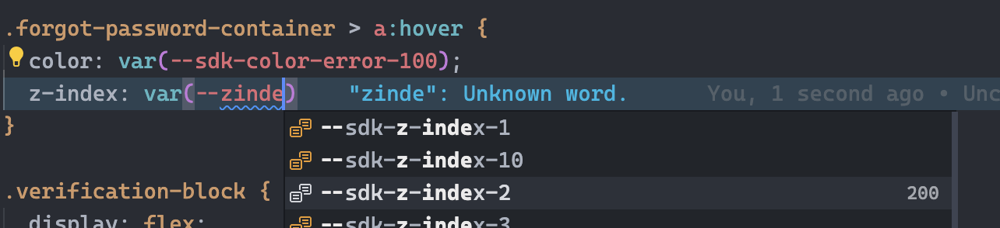
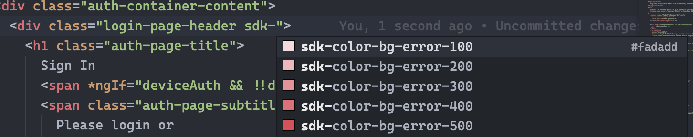
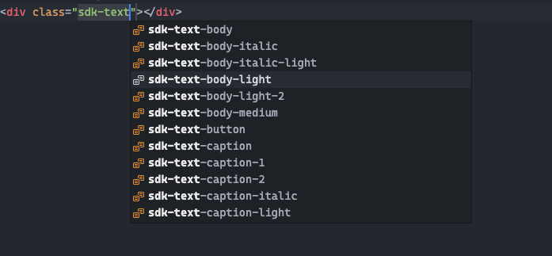
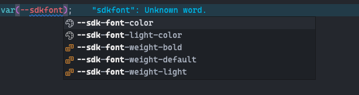
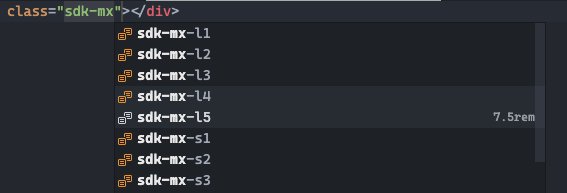
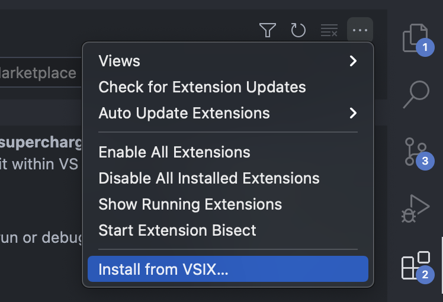

# draftkit-intellisense README

This extension provides auto-complete for SpotDraft's internal, non-TS/JS utilities like colors and utility classes.

## Provides IntelliSense for -

#### Color variables `--sdk-color-*` in CSS/SCSS & HTML Files.

#### zIndex map values in CSS/SCSS & HTML Files.

#### Background utility classes in HTML Files.

#### Typography Classes

#### Font Variables

#### Spacing Utils

## Installing

Download the VSIX package from [Releases Page](https://github.com/SpotDraft/draftkit-intellisense/releases)

## Building & Contributing

- Requires npm 14+
- Clone the repo.
- `npm ci`
- Follow [instructions here](https://code.visualstudio.com/api/get-started/your-first-extension) to see your extension in action while developing.

### tokens.json

The colors are exported from Figma using the `Figma Tokens` plugins and then cleaned up to remove everything but `System Colors 2.0`

### Packaging

For creating a new release, the VSCE CLI tool is required.
[https://code.visualstudio.com/api/working-with-extensions/publishing-extension#packaging-extensions](https://code.visualstudio.com/api/working-with-extensions/publishing-extension#packaging-extensions)

## LICENSE

MIT License

Copyright (c) 2022 SpotDraft

Permission is hereby granted, free of charge, to any person obtaining a copy
of this software and associated documentation files (the "Software"), to deal
in the Software without restriction, including without limitation the rights
to use, copy, modify, merge, publish, distribute, sublicense, and/or sell
copies of the Software, and to permit persons to whom the Software is
furnished to do so, subject to the following conditions:

The above copyright notice and this permission notice shall be included in all
copies or substantial portions of the Software.

THE SOFTWARE IS PROVIDED "AS IS", WITHOUT WARRANTY OF ANY KIND, EXPRESS OR
IMPLIED, INCLUDING BUT NOT LIMITED TO THE WARRANTIES OF MERCHANTABILITY,
FITNESS FOR A PARTICULAR PURPOSE AND NONINFRINGEMENT. IN NO EVENT SHALL THE
AUTHORS OR COPYRIGHT HOLDERS BE LIABLE FOR ANY CLAIM, DAMAGES OR OTHER
LIABILITY, WHETHER IN AN ACTION OF CONTRACT, TORT OR OTHERWISE, ARISING FROM,
OUT OF OR IN CONNECTION WITH THE SOFTWARE OR THE USE OR OTHER DEALINGS IN THE
SOFTWARE.
